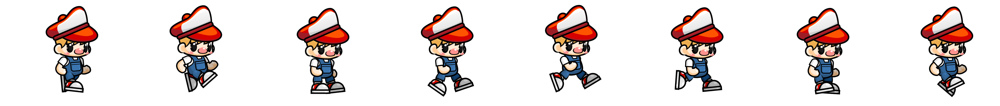
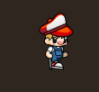

- Source For Characters :
		https://www.gameart2d.com/
- Source For Create Sprite From Images :
		https://codeshack.io/images-sprite-sheet-generator/
## Basics :
- **Sprite** : a two-dimensional image or animation that is integrated into a larger scene or game environment. 
	
	`in this image the idle is the 3rd quad so don't get confused in the code :)`

- **Quad** :  a rectangular region that defines a subsection of a larger image (usually a sprite sheet) to be rendered or drawn on the screen.a quad allows you to display only a specific portion of a texture (image) instead of the whole image.
	- The purpose of a Quad is to use a fraction of a texture to draw objects, as opposed to drawing the entire texture. It is most useful for sprite sheets and atlases: in a sprite atlas, multiple sprites reside in the same texture, quad is used to draw a specific sprite from that texture; in animated sprites with all frames residing in the same texture, quad is used to draw specific frame from the animation.
	
		 
## Moving The Character Code :
- Some Good Resources To See Before Reading Code :
	- How To Mirror Or Flip Character : https://love2d.org/forums/viewtopic.php?t=9511
	- love.graphics.newQuad : https://love2d.org/wiki/love.graphics.newQuad
		- 2 Last Arugments :
			- full sprite sheet width and : This tells LOVE2D the total width or ehight of the entire sprite sheet. The quad is a rectangular region extracted from this large image, so the engine needs to know the full width to correctly calculate texture coordinates. (with out this love2d can't tell the quad is with part of the sprite)
			
	
``` lua
-- Require the LOVE2D library

_G.love = require("love")

  

function love.load()

    -- Initialize the character "jack" with its properties

    jack = {

        x = 0,  -- starting x position

        y = 0,  -- starting y position

        sprite = {

            -- Load the sprite sheet image with all frames

            image = love.graphics.newImage("sprites/spritesheet.png"),

            -- The dimensions of the full sprite sheet image

            height = 569,  -- Total height (in pixels) of the sprite sheet

            width = 5352,  -- Total width (in pixels) of the sprite sheet

            -- The dimensions of each animation frame (quad)

            quad_height = 569,  -- Height of one frame

            quad_width = 669    -- Width of one frame

        },

        quads = {},  -- This table will store each individual quad (animation frame)

        animation = {

            direction = "right",  -- The current facing direction (could be "right" or "left")

            idle = true,          -- Is the character standing still?

            frame = 1,            -- The current frame in the animation

            max_frames = 8,       -- Total number of frames (quads) in the animation

            speed = 20,           -- How fast the character moves per update call (a measure of velocity)

            timer = 0.1           -- Timer to control when to change animation frames

        }

    }

    -- Create a quad for each animation frame in the sprite sheet and store it in jack.quads.

    for i = 1, jack.animation.max_frames do

        jack.quads[i] = love.graphics.newQuad(

            jack.sprite.quad_width * (i - 1),  -- x coordinate of the quad on the sprite sheet

            0,                                 -- y coordinate (all frames are on the same row)

            jack.sprite.quad_width,            -- width of the quad

            jack.sprite.quad_height,           -- height of the quad

            jack.sprite.width,                 -- full sprite sheet width (needed for proper scaling)

            jack.sprite.height                 -- full sprite sheet height

        )

    end

end

  

function love.update(dt)

    -- Check keyboard input to control movement

    if love.keyboard.isDown("d") then

        -- Move character to the right

        jack.animation.idle = false             -- Not idle while moving

        jack.x = jack.x + jack.animation.speed    -- Update x position

        jack.direction = "right"                  -- Set direction to right

    elseif love.keyboard.isDown("a") then

        -- Move character to the left

        jack.animation.idle = false             -- Not idle while moving

        jack.x = jack.x - jack.animation.speed    -- Update x position

        jack.direction = "left"                   -- Set direction to left

    else

        -- No movement detected, the character is idle

        jack.animation.idle = true

        jack.animation.frame = 1                  -- Reset animation frame to the idle frame

    end

  

    -- Update the animation timer and frame only if character is moving (not idle)

    if not jack.animation.idle then

        jack.animation.timer = jack.animation.timer + dt  -- Increment timer by the time passed since last update

  

        -- When the timer exceeds 0.2 seconds, switch to the next frame

        if jack.animation.timer > 0.2 then

            jack.animation.timer = 0.1       -- Reset timer (could also be set to 0)

            jack.animation.frame = jack.animation.frame + 1  -- Move to next frame

  

            -- Loop back to the first frame if we've exceeded the maximum

            if jack.animation.frame > jack.animation.max_frames then

                jack.animation.frame = 1

            end

        end

    end

end

  

function love.draw()

    -- Scale the graphics so that the sprite appears at a reasonable size on the screen

    love.graphics.scale(0.3)

  

    if jack.direction == "right" then

        -- Draw the sprite facing right using the current animation frame

        love.graphics.draw(

            jack.sprite.image,        -- The full sprite sheet image

            jack.quads[jack.animation.frame],  -- The current frame (quad) to be drawn

            jack.x,                   -- x position on the screen

            jack.y                    -- y position on the screen

        )

    else

        -- Draw the sprite facing left. To flip the sprite horizontally,

        -- we scale the x-axis by -1 and adjust the origin.

        love.graphics.draw(

            jack.sprite.image,        -- The full sprite sheet image

            jack.quads[jack.animation.frame],  -- The current frame (quad) to be drawn

            jack.x,                   -- x position on the screen

            jack.y,                   -- y position on the screen

            0,                        -- rotation (0 means no rotation)

            -1,                       -- x scale (-1 flips the image horizontally)

            1,                        -- y scale (1 means no vertical flip)

            jack.sprite.quad_width,   -- x-offset to set the origin (ensures flipping around the correct point)

            0                         -- y-offset (optional, 0 by default)

        )

    end

end
```
